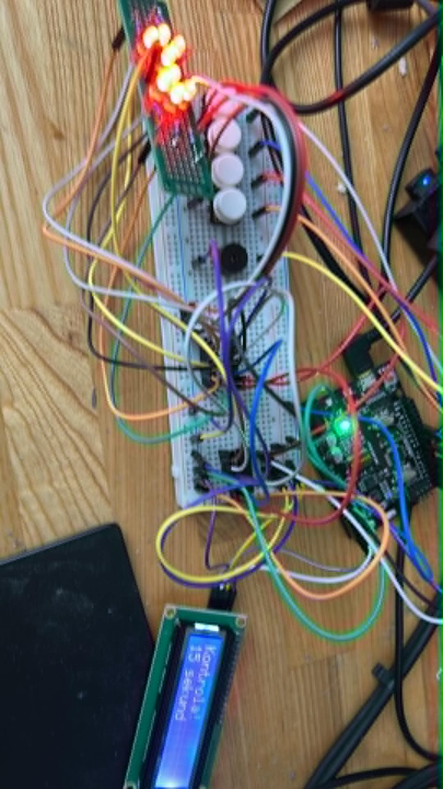
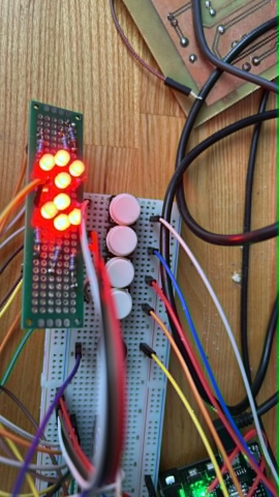
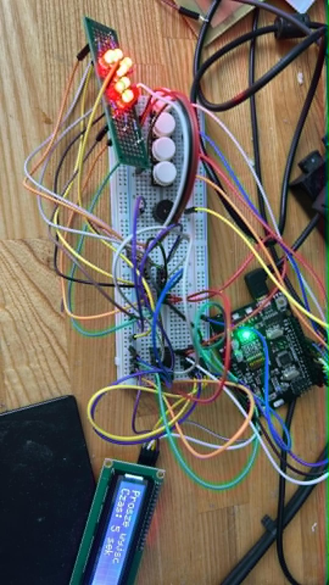
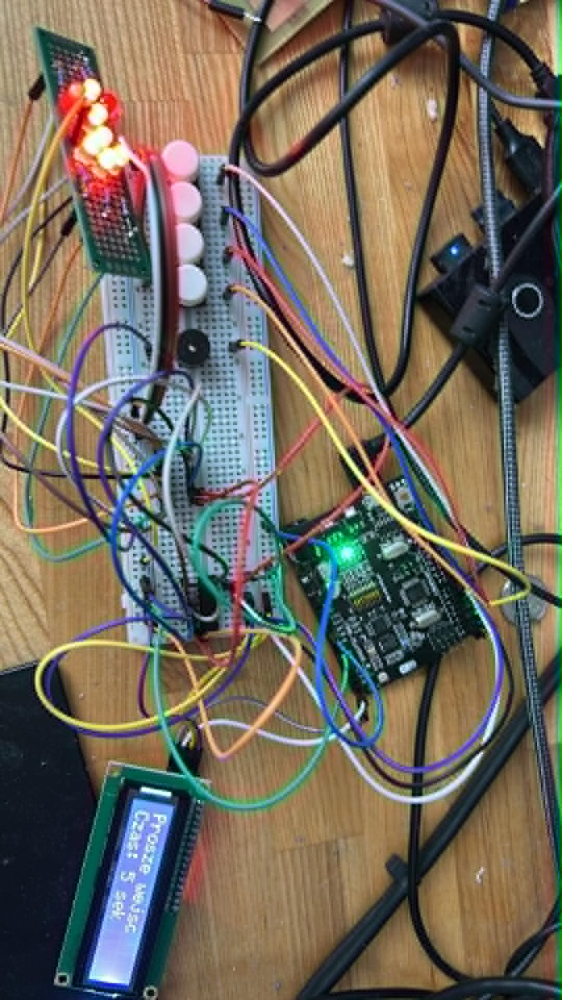

# System kontroli wejścia/wyjścia z losomatem

Projekt przedstawia prototyp systemu kontroli przejścia zbudowany na mikrokontrolerze **ATmega328P / Arduino UNO / Arduino Nano**. System obsługuje wejście i wyjście osób, losową kontrolę przy wyjściu, licznik osób w środku oraz sygnalizację na wyświetlaczu LCD, diodach LED i buzzerze.

Projekt został napisany w języku **C dla AVR**, bez użycia Arduino `setup()` / `loop()`.

---

## Podgląd działania

| Prototyp układu | Sygnalizacja LED |
|---|---|
|  |  |

| Stan procedury | Okablowanie i moduły |
|---|---|
|  |  |

### Stan oczekiwania na losomat



---

## Główne funkcje

- symulacja karty wejścia,
- symulacja karty wyjścia,
- losomat z prawdopodobieństwem kontroli około 50%,
- licznik osób znajdujących się w środku,
- komunikaty na LCD 16x2 przez I2C,
- sygnalizacja wejścia strzałką w prawo,
- sygnalizacja wyjścia strzałką w lewo,
- sygnalizacja kontroli przez zapalenie wszystkich diod,
- buzzer ciągły podczas odblokowania przejścia,
- buzzer przerywany podczas kontroli,
- obsługa niepoprawnych akcji bez resetowania całej procedury.

---

## Elementy użyte w projekcie

| Element | Zastosowanie |
|---|---|
| ATmega328P / Arduino UNO / Nano | Główny mikrokontroler |
| LCD 16x2 I2C | Wyświetlanie komunikatów i licznika osób |
| 74HC595 | Sterowanie diodami LED |
| Diody LED | Strzałki wejścia/wyjścia oraz sygnalizacja kontroli |
| 4 przyciski | Karta wejścia, karta wyjścia, losomat, krańcówka |
| Buzzer EAK-00786 | Sygnalizacja dźwiękowa |
| Płytka prototypowa | Montaż testowy układu |
| Przewody połączeniowe | Połączenia między modułami |

---

## Podłączenie LCD I2C

Dla Arduino UNO/Nano:

| LCD I2C | Arduino |
|---|---|
| GND | GND |
| VCC | 5V |
| SDA | A4 |
| SCL | A5 |

Domyślny adres LCD w kodzie:

```c
LCD_Init(0x27);
```

Jeżeli LCD nie pokazuje tekstu, można spróbować adresu:

```c
LCD_Init(0x3F);
```

Warto też pokręcić potencjometrem kontrastu na module I2C.

---

## Podłączenie przycisków

Przyciski są podłączone do masy i działają z wewnętrznym rezystorem pull-up mikrokontrolera.

Schemat dla każdego przycisku:

```text
PIN Arduino ---- przycisk ---- GND
```

Nie podłączamy przycisków do 5V.

| Funkcja | Pin Arduino | Port AVR |
|---|---:|---|
| Karta wejścia | D2 | PD2 |
| Karta wyjścia | D3 | PD3 |
| Losomat | D4 | PD4 |
| Krańcówka drzwi/przejścia | D5 | PD5 |

Logika wejść:

```text
przycisk puszczony = HIGH = 1
przycisk wciśnięty = LOW  = 0
```

Dlatego w kodzie używane jest makro:

```c
#define PRESSED(pin) (!(PIND & (1 << pin)))
```

---

## Podłączenie buzzera

Użyty buzzer to **EAK-00786**, czyli aktywny buzzer z generatorem.

| Buzzer | Arduino |
|---|---|
| + | D6 |
| - | GND |

W kodzie:

```c
#define BUZZER_PIN PD6
```

Działanie buzzera:

| Stan systemu | Buzzer |
|---|---|
| Wejście odblokowane na 5 s | sygnał ciągły |
| Wyjście odblokowane na 5 s | sygnał ciągły |
| Osoba przechodzi | wyłączony |
| Kontrola | sygnał przerywany co 0,5 s |
| Idle | wyłączony |

---

## Podłączenie rejestru 74HC595

Rejestr 74HC595 steruje diodami LED. W projekcie używana jest funkcja:

```c
HW_ShiftOut(uint8_t data);
```

Przykładowe wartości wysyłane do rejestru:

```c
#define STRZALKA_L  (GROT_L | TRZON)
#define STRZALKA_P  (GROT_P | TRZON)
#define LED_OFF     0x00
#define LED_ALL     0xFF
```

| Wartość | Efekt |
|---|---|
| `STRZALKA_P` | strzałka wejścia, czyli w prawo |
| `STRZALKA_L` | strzałka wyjścia, czyli w lewo |
| `LED_OFF` | wszystkie diody zgaszone |
| `LED_ALL` | wszystkie diody zapalone podczas kontroli |

---

## Logika działania

System działa jako maszyna stanów. Nie wykonuje kolejnych ekranów automatycznie, tylko czeka na akcje użytkownika: kartę, losomat albo krańcówkę.

---

## Procedura wejścia

### 1. Stan początkowy

Po uruchomieniu system przechodzi do stanu `Idle`.

LCD pokazuje:

```text
Idle
Osoby: 0
```

---

### 2. Użycie karty wejścia

Użytkownik naciska przycisk karty wejścia.

System przechodzi do stanu:

```c
STATE_ENTRY_UNLOCKED
```

LCD pokazuje:

```text
Prosze wejsc
Czas: 5 sek
```

W tym stanie:

- zapala się strzałka w prawo,
- buzzer piszczy ciągle,
- system czeka maksymalnie 5 sekund na aktywowanie krańcówki.

---

### 3. Brak przejścia

Jeżeli w ciągu 5 sekund krańcówka nie zostanie aktywowana, system blokuje przejście.

LCD pokazuje:

```text
Czas minal
Zablokowano
```

Następnie system wraca do `Idle`.

---

### 4. Osoba przechodzi

Jeżeli osoba aktywuje krańcówkę, system przechodzi do:

```c
STATE_ENTRY_PASSING
```

LCD pokazuje:

```text
Drzwi otwarte
Przechodzi...
```

W tym momencie:

- strzałka gaśnie,
- buzzer gaśnie.

---

### 5. Zakończenie wejścia

Po puszczeniu krańcówki system uznaje, że osoba weszła.

Licznik osób zwiększa się o 1 i system wraca do `Idle`.

---

## Procedura wyjścia

### 1. Użycie karty wyjścia

Użytkownik naciska przycisk karty wyjścia.

Jeżeli licznik osób jest większy od 0, system przechodzi do:

```c
STATE_EXIT_WAIT_LOTTERY
```

LCD pokazuje:

```text
Wcisnij
losomat
```

System czeka na kliknięcie losomatu.

---

### 2. Losowanie

Po naciśnięciu losomatu system losuje wynik około 50/50:

- brak kontroli,
- kontrola.

---

### 3. Brak kontroli

Jeżeli nie zostanie wylosowana kontrola, system przechodzi do:

```c
STATE_EXIT_UNLOCKED
```

LCD pokazuje:

```text
Prosze wyjsc
Czas: 5 sek
```

W tym stanie:

- zapala się strzałka w lewo,
- buzzer piszczy ciągle,
- użytkownik ma 5 sekund na rozpoczęcie przejścia.

---

### 4. Kontrola

Jeżeli zostanie wylosowana kontrola, system przechodzi do:

```c
STATE_EXIT_SEARCH
```

LCD pokazuje:

```text
Kontrola!
15 sekund
```

W tym stanie:

- świecą wszystkie diody,
- buzzer działa przerywanie,
- kontrola trwa 15 sekund.

Buzzer podczas kontroli:

```text
0,5 s ON
0,5 s OFF
0,5 s ON
0,5 s OFF
```

Po 15 sekundach system pozwala na wyjście.

---

### 5. Osoba wychodzi

Po zakończeniu kontroli albo po braku kontroli użytkownik może wyjść.

Po aktywowaniu krańcówki system przechodzi do:

```c
STATE_EXIT_PASSING
```

LCD pokazuje:

```text
Drzwi otwarte
Wychodzi...
```

W tym momencie:

- strzałka gaśnie,
- buzzer gaśnie.

---

### 6. Zakończenie wyjścia

Po puszczeniu krańcówki system uznaje, że osoba wyszła.

Licznik zmniejsza się o 1 i system wraca do `Idle`.

---

## Niepoprawne akcje

System obsługuje błędne akcje bez resetowania całej procedury.

| Sytuacja | Komunikat |
|---|---|
| Losomat wciśnięty bez wcześniejszej karty | `Najpierw / uzyj karty` |
| Karta wyjścia przy liczniku 0 | `Brak osob / w srodku` |
| Drzwi otwarte przed kliknięciem losomatu | `Najpierw / losomat` |
| Drzwi otwarte podczas kontroli | `Trwa / kontrola` |
| Zła akcja w trakcie procedury | `Niepoprawna / akcja` |

Po pokazaniu komunikatu system wraca do poprzedniej akcji.

Przykład:

```text
Wcisnij
losomat
```

Jeżeli użytkownik otworzy drzwi przed kliknięciem losomatu:

```text
Najpierw
losomat
```

Po chwili system wróci do:

```text
Wcisnij
losomat
```

---

## Stany systemu

| Stan | Znaczenie |
|---|---|
| `STATE_IDLE` | Normalna praca, oczekiwanie na akcję |
| `STATE_ENTRY_UNLOCKED` | Wejście odblokowane na 5 sekund |
| `STATE_ENTRY_PASSING` | Osoba wchodzi |
| `STATE_EXIT_WAIT_LOTTERY` | Oczekiwanie na kliknięcie losomatu |
| `STATE_EXIT_SEARCH` | Kontrola trwająca 15 sekund |
| `STATE_EXIT_UNLOCKED` | Wyjście odblokowane na 5 sekund |
| `STATE_EXIT_PASSING` | Osoba wychodzi |

---

## Diagram działania

### Wejście

```text
Idle
  |
  | karta wejścia
  v
Entry Unlocked
  |
  | krańcówka aktywna
  v
Entry Passing
  |
  | krańcówka puszczona
  v
Idle + licznik +1
```

### Wyjście

```text
Idle
  |
  | karta wyjścia
  v
Wait Lottery
  |
  | losomat
  v
Kontrola? 50/50
  |
  +---- brak kontroli ----> Exit Unlocked
  |
  +---- kontrola ---------> Search 15 s ----> Exit Unlocked

Exit Unlocked
  |
  | krańcówka aktywna
  v
Exit Passing
  |
  | krańcówka puszczona
  v
Idle + licznik -1
```

---

## Struktura projektu

Przykładowa struktura repozytorium:

```text
AVR/
├── main.c
├── lcd_i2c.c
├── lcd_i2c.h
├── hardware.c
├── hardware.h
├── makefile
├── README.md
└── docs/
    └── images/
        ├── 01-prototype-overview.jpg
        ├── 02-control-leds.jpg
        ├── 03-state-transition.jpg
        ├── 04-hardware-wiring.jpg
        └── 05-lcd-lottery.jpg
```

Opcjonalnie, jeżeli projekt zawiera oddzielny moduł strzałek:

```text
├── arrow.c
└── arrow.h
```

Aktualna wersja głównej logiki używa bezpośrednio:

```c
HW_ShiftOut(...);
```

więc pliki `arrow.c` i `arrow.h` nie są wymagane.

---

## Kompilacja

Przykładowy fragment `makefile`:

```makefile
SRC = \
main.c \
lcd_i2c.c \
hardware.c

INC = \
-I.
```

Jeżeli zostawiasz `arrow.c`:

```makefile
SRC = \
main.c \
lcd_i2c.c \
hardware.c \
arrow.c

INC = \
-I.
```

Kompilacja:

```bash
make
```

Wgranie programu zależy od konfiguracji Twojego `makefile`, np.:

```bash
make flash
```

---

## Najczęstsze problemy

### LCD świeci, ale nic nie pokazuje

Sprawdź:

- adres LCD: `0x27` albo `0x3F`,
- potencjometr kontrastu na module I2C,
- przewody SDA/SCL,
- zasilanie 5V.

---

### Przyciski działają odwrotnie

Przyciski muszą być podłączone do GND:

```text
pin Arduino ---- przycisk ---- GND
```

Wewnętrzny pull-up jest włączony programowo.

---

### Przycisk cały czas jest wciśnięty

Prawdopodobnie przycisk 4-nóżkowy jest źle włożony w płytkę prototypową.

Najlepiej włożyć go przez środkowy rowek płytki.

Należy znaleźć dwie nóżki, które:

```text
nie przewodzą, gdy przycisk jest puszczony
przewodzą, gdy przycisk jest wciśnięty
```

---

### Buzzer nie piszczy

Sprawdź podłączenie:

```text
+ buzzera -> D6
- buzzera -> GND
```

Dla buzzera EAK-00786 wystarczy podać stan wysoki na D6, ponieważ jest to buzzer aktywny.

---

### Strzałki świecą odwrotnie

Jeżeli kierunki są zamienione, wystarczy zamienić funkcje:

```c
static void Arrow_Entry(void)
{
    HW_ShiftOut(STRZALKA_P);
}

static void Arrow_Exit(void)
{
    HW_ShiftOut(STRZALKA_L);
}
```

na:

```c
static void Arrow_Entry(void)
{
    HW_ShiftOut(STRZALKA_L);
}

static void Arrow_Exit(void)
{
    HW_ShiftOut(STRZALKA_P);
}
```

---

## Podsumowanie

Projekt pokazuje praktyczne zastosowanie maszyny stanów w języku C na mikrokontrolerze AVR.

Najważniejsze zasady działania:

- karta wejścia uruchamia procedurę wejścia,
- karta wyjścia uruchamia procedurę wyjścia,
- losomat decyduje o kontroli,
- kontrola trwa 15 sekund,
- przejście musi rozpocząć się w ciągu 5 sekund od odblokowania,
- licznik osób aktualizuje się dopiero po puszczeniu krańcówki,
- błędne akcje nie przerywają procedury,
- LCD pokazuje aktualny stan,
- LED-y i buzzer sygnalizują aktualną akcję.
